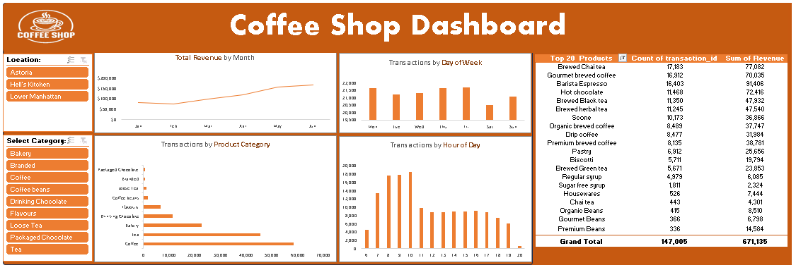

dashboard.png.png
# ☕ Coffee Shop Sales Analysis Project

## 📌 Project Overview
This project focuses on analyzing sales transactions for a retail coffee shop. By processing over **149,000 records**, I extracted actionable insights regarding sales trends, peak operational hours, and product popularity to help optimize business performance.

## 📊 Business Dashboard
*(Optional: Description of your Excel/PowerBI Dashboard)*
Below is the visual representation of the key performance indicators (KPIs) and sales trends.

# ☕ Coffee Shop Sales Analysis Project

## 📌 Project Overview
This project focuses on analyzing sales transactions for a retail coffee shop. By processing over **149,000 records**, I extracted actionable insights regarding sales trends, peak operational hours, and product popularity to help optimize business performance.

## 📊 Business Dashboard
*(Optional: Description of your Excel/PowerBI Dashboard)*
Below is the visual representation of the key performance indicators (KPIs) and sales trends.

## 🛠️ Tech Stack & Skills
- **Excel:** Advanced Pivot Tables, Data Cleaning, and Dashboard Design.
- **Data Analysis:** Trend Analysis, Sales Forecasting, and Customer Behavior Mapping.
- **GitHub:** Project Documentation and Version Control.

## 📈 Key Insights
Through the analysis of data from January to June 2023, the following insights were discovered:
- **Revenue Growth:** Total revenue reached **$698,812**, with a significant peak in **June ($166,485)**.
- **Peak Hours:** The highest transaction volume occurs during the morning rush between **8:00 AM and 10:00 AM**.
- **Top Products:** **Barista Espresso** is the top revenue generator ($91.4k), while **Brewed Chai Tea** is the most sold item by quantity.
- **Location Performance:** Comparative analysis between Astoria, Hell's Kitchen, and Lower Manhattan stores.

## 📁 Repository Structure
- `Data/`: Contains raw transactions and pivot table summaries.
- `visuals/`: Contains the dashboard images and charts.
- `README.md`: Project documentation.

## 🛠️ Tech Stack & Skills
- **Excel:** Advanced Pivot Tables, Data Cleaning, and Dashboard Design.
- **Data Analysis:** Trend Analysis, Sales Forecasting, and Customer Behavior Mapping.
- **GitHub:** Project Documentation and Version Control.

## 📈 Key Insights
Through the analysis of data from January to June 2023, the following insights were discovered:
- **Revenue Growth:** Total revenue reached **$698,812**, with a significant peak in **June ($166,485)**.
- **Peak Hours:** The highest transaction volume occurs during the morning rush between **8:00 AM and 10:00 AM**.
- **Top Products:** **Barista Espresso** is the top revenue generator ($91.4k), while **Brewed Chai Tea** is the most sold item by quantity.
- **Location Performance:** Comparative analysis between Astoria, Hell's Kitchen, and Lower Manhattan stores.

## 📁 Repository Structure
- `Data/`: Contains raw transactions and pivot table summaries.
- `visuals/`: Contains the dashboard images and charts.
- `README.md`: Project documentation.
